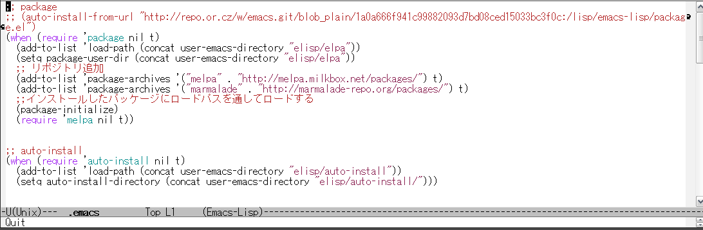
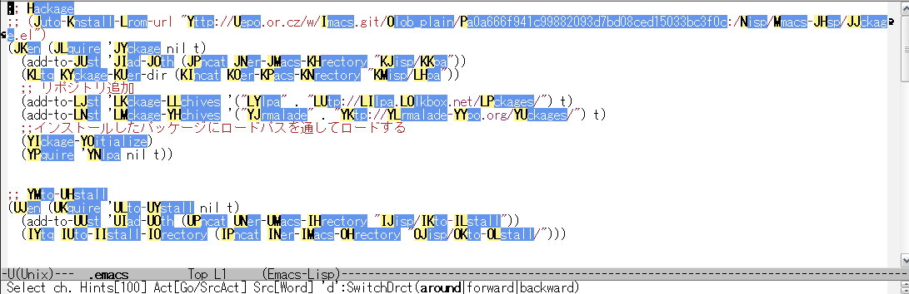
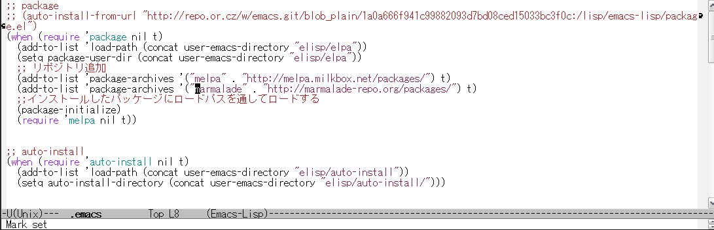
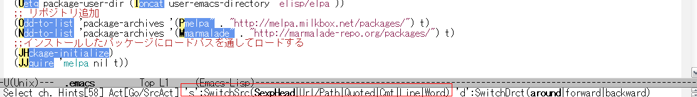
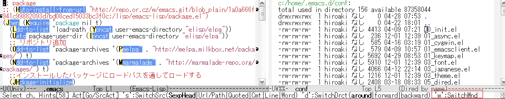

[](https://travis-ci.org/aki2o/emacs-pophint)

# What's this?

This is a extension of Emacs that provide navigation like the Vimperator/Keysnail Hint Mode of Firfox.  

Do you know Vimperator/Keysnail of Firefox Addon?  
If you don't know it, see a screenshot below.


The hints that has a alphabet code are shown when you push a "f" key on Firefox like above.  
Then, if you push the alphabet, you can jump the linked URL.  

This extension provides same interface on Emacs.  

# Screenshot

Show the simplest using way.  
If some buffer is opened like the following.  



If you execute the command that are provided by this extension, the buffer is like the following.  



If you push the shown alphabet, cursol is moved to the point like the following.  
The following is in the case that pushed "yj". Large alphabet is shown, but inputing small alphabet is OK.  



# Feature

### Scalability

This extension provides the following interface.  
1.  show the pop-up hints *SOMEWHERE* on any window.
2.  do *ACTION* to the point and text that is selected by user.

You can add or change the *SOMEWHERE* and *ACTION* by definition *SOURCE*.  
*SOURCE* is Alist which has structure like `anything-source-...` of anything.el or `ac-source-...` of auto-complete.el.  

And,  
if you have a idea about *ACTION* that are avilable for any *SOURCE*,  
you can define the *ACTION* for using anytime particularly.  
For example, I think moving cursol to the point and copying the text are fit into the *ACTION*.  

Some sources and actions are defined already in pophint-config.el.  
For detail, see pophint-config.el section below.  

### Switch source quickly

If you execute the command that handle multiple source, the message is shown in minibuffer like the following.  



Then, you can switch a used source by pushing a "s" key.  
And, you can customize the key binding.  

### Show the pop-up hints on other window

If you execute the command that show the pop-up hint in the situation that a frame has some windows,  
the message is shown in minibuffer like the following.  



Then, you can switch a target window by pushing a "w" key.  
And, you can customize the key binding.  

### Various Functions for user

The above feature is not concrete about what the user will can do.  
About it, see <https://github.com/aki2o/emacs-pophint/wiki>

# Install

### If use package.el

2013/07/19 It's available by using melpa.  

### If use el-get.el

2013/05/01 Now during an application for registration in el-get.  
2013/06/30 But, not yet regist.  
2013/07/26 It's available. But, master branch only.  

### If use auto-install.el

```lisp
(auto-install-from-url "https://raw.github.com/aki2o/emacs-pophint/master/pophint.el")
(auto-install-from-url "https://raw.github.com/aki2o/emacs-pophint/master/pophint-config.el")
```
-   In this case, you need to install each of the following dependency.

### Manually

Download pophint.el and put it on your load-path.  
-   In this case, you need to install each of the following dependency.

### Dependency

-   popup.el &#x2026; bundled with 
-   
-   

# Configuration

About Sample, see <https://github.com/aki2o/emacs-pophint/wiki/ConfigExample>.  
For more information, see Configuration section in <https://github.com/aki2o/emacs-pophint/wiki>.  

# Tested On

-   Emacs &#x2026; GNU Emacs 23.3.1 (i386-mingw-nt5.1.2600) of 2011-08-15 on GNUPACK
-   popup.el &#x2026; 0.5.0
-   log4e.el &#x2026; 0.1
-   yaxception.el &#x2026; 0.1
-   w3m.el &#x2026; 1.4.472

**Enjoy!!!**
