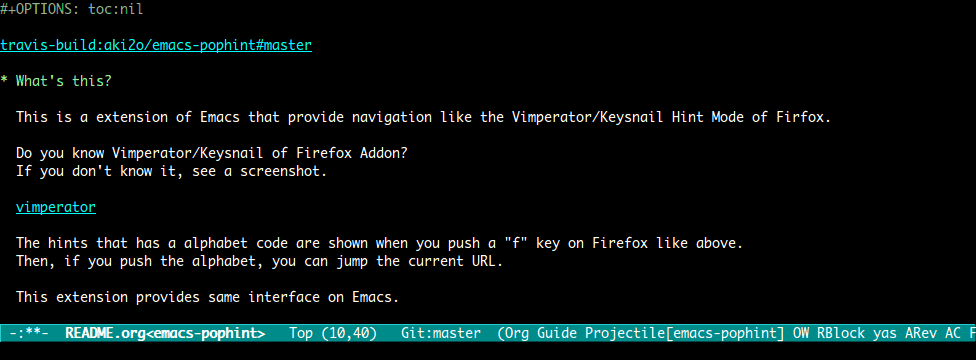
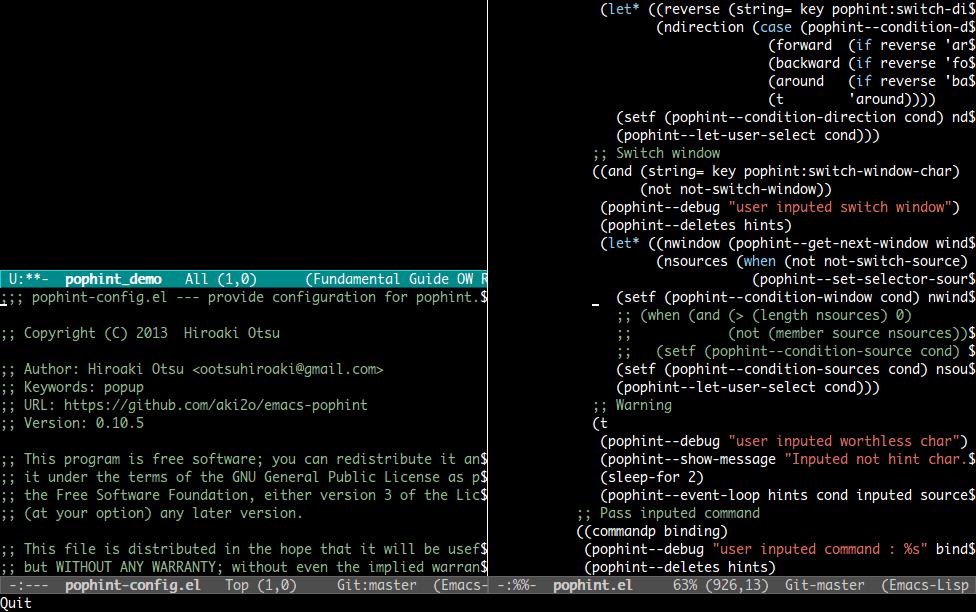
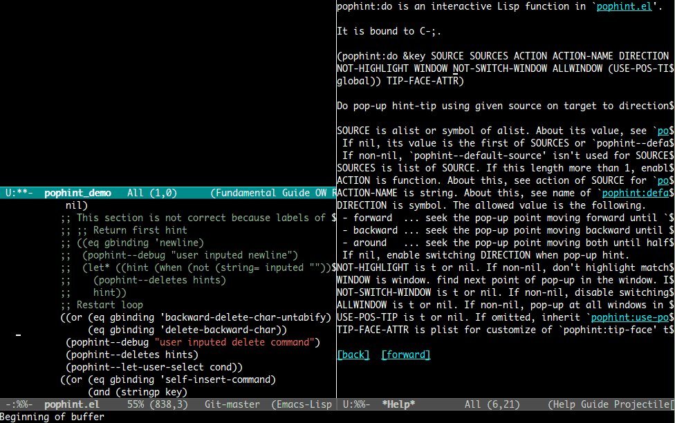

[](https://travis-ci.org/aki2o/emacs-pophint)

# What's this?

This is a extension of Emacs that provide navigation like the Vimperator/Keysnail Hint Mode of Firfox.  

Do you know Vimperator/Keysnail of Firefox Addon?  
If you don't know it, see a screenshot below.


The hints that has a alphabet code are shown when you push a "f" key on Firefox like above.  
Then, if you push the alphabet, you can jump the linked URL.  

This extension provides same interface on Emacs.  

# Feature

This extension is the framework provides showing hints on *LOCATION* at first, then doing *ACTION* for the selected.  
The simplest case is just move.  



You can configure easily *LOCATION*, *ACTION* and more.  
Then, they are configured already in `pophint-config.el`.  
Here is a part of them.  



More, navigate you in many situation.  



For checking all function,  
see Bundled Function section in <https://github.com/aki2o/emacs-pophint/wiki>.  

# Install

### If use package.el

2013/07/19 It's available by using melpa.  

### If use el-get.el

2013/05/01 Now during an application for registration in el-get.  
2013/06/30 But, not yet regist.  
2013/07/26 It's available. But, master branch only.  

### If use auto-install.el

```lisp
(auto-install-from-url "https://raw.github.com/aki2o/emacs-pophint/master/pophint.el")
(auto-install-from-url "https://raw.github.com/aki2o/emacs-pophint/master/pophint-config.el")
```
-   In this case, you need to install each of the following dependency.

### Manually

Download pophint.el and put it on your load-path.  
-   In this case, you need to install each of the following dependency.

### Dependency

-   popup.el &#x2026; bundled with [auto-complete.el](https://github.com/auto-complete/auto-complete)
-   [log4e.el](https://github.com/aki2o/log4e)
-   [yaxception.el](https://github.com/aki2o/yaxception)

# Configuration

You can find a sample at <https://github.com/aki2o/emacs-pophint/wiki/ConfigExample>.  
For more information,  
see Configuration section in <https://github.com/aki2o/emacs-pophint/wiki>.  

# Tested On

-   Emacs &#x2026; GNU Emacs 23.3.1 (i386-mingw-nt5.1.2600) of 2011-08-15 on GNUPACK
-   popup.el &#x2026; 0.5.0
-   log4e.el &#x2026; 0.1
-   yaxception.el &#x2026; 0.1
-   w3m.el &#x2026; 1.4.472

**Enjoy!!!**
